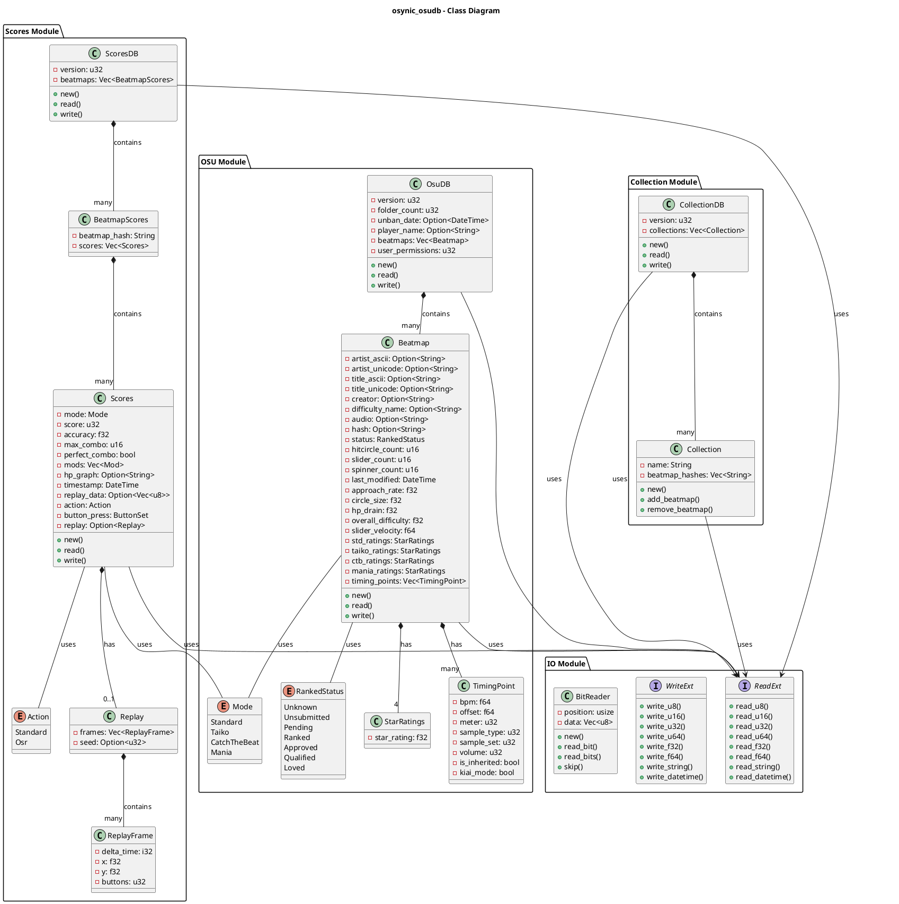
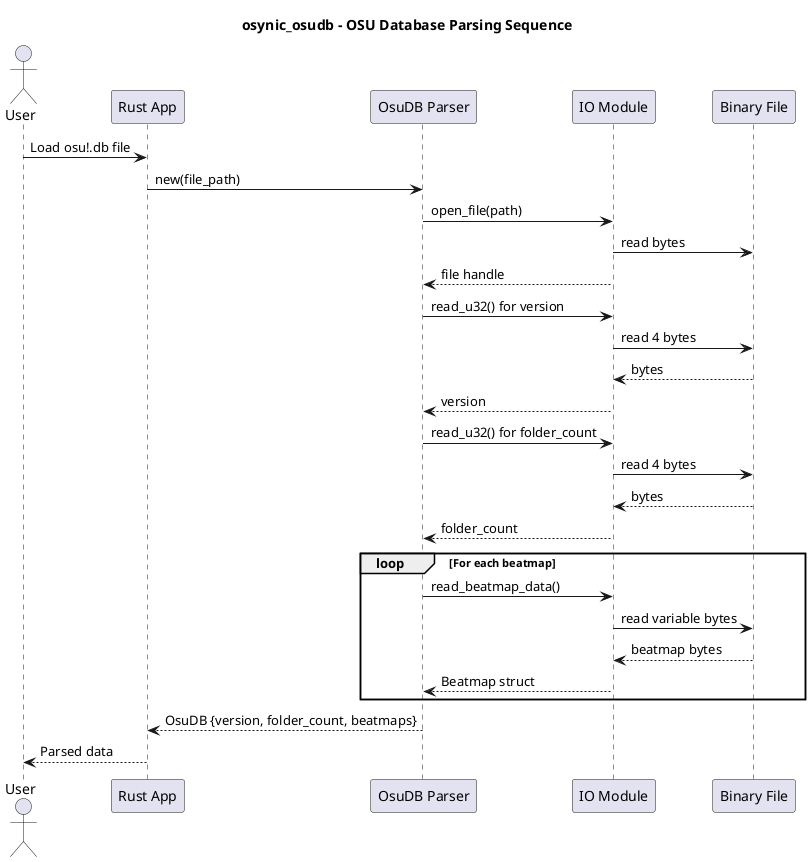
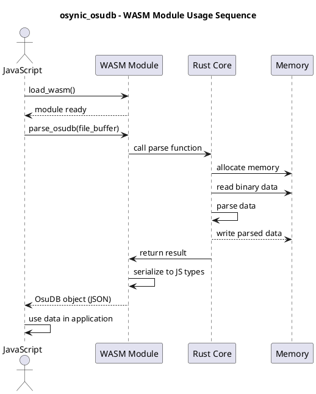
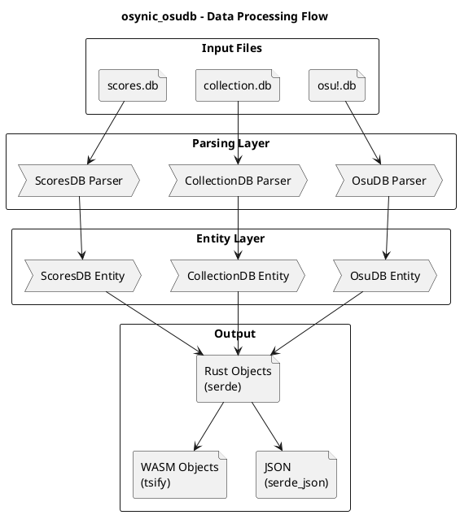
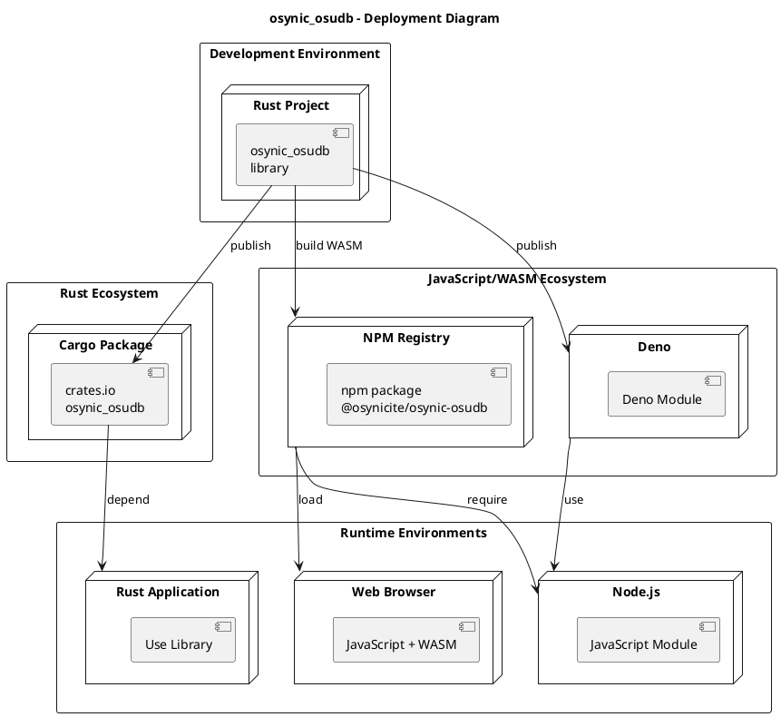
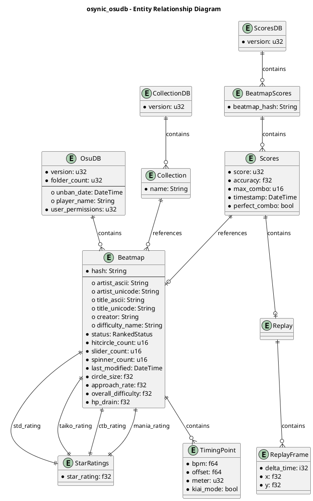

# Osynic OsuDB - Architecture Diagrams

这个文档包含了 osynic_osudb 项目的各种架构图，使用 PlantUML 绘制。

## 1. C4 Context Diagram - 系统上下文图

展示整个系统与外部系统的交互关系。

```plantuml
@startuml C4_Context
!include https://raw.githubusercontent.com/plantuml-stdlib/C4-PlantUML/master/C4_Context.puml

title osynic_osudb - System Context

Person(user, "osu! 用户", "需要解析游戏数据库文件")
System(osynic, "Osynic OsuDB", "高性能 osu! 数据库解析库")

System_Ext(osu_game, "osu! Game Client", "生成 .db 文件")
System_Ext(rust_app, "Rust 应用", "调用库进行数据解析")
System_Ext(web_app, "Web/Node.js 应用", "通过 WASM 调用库")

Rel(user, osu_game, "使用")
Rel(osu_game, osynic, "生成数据库文件")
Rel(rust_app, osynic, "调用库 API")
Rel(web_app, osynic, "通过 WASM 调用")

footer C4 Context Diagram
@enduml
```

## 2. C4 Container Diagram - 容器图

展示系统内部的主要容器和它们之间的关系。

```plantuml
@startuml C4_Container
!include https://raw.githubusercontent.com/plantuml-stdlib/C4-PlantUML/master/C4_Container.puml

title osynic_osudb - Container Diagram

Person(user, "开发者", "使用库来解析 osu! 数据库")

Container(io_module, "IO Module", "Rust", "处理二进制读写操作\n- read.rs: 二进制读取\n- write.rs: 二进制写入\n- bit.rs: 位操作")

Container(entity_osu, "OSU Entity", "Rust", "osu!.db 相关数据结构\n- OsuDB: 主数据库\n- Beatmap: 谱面信息\n- Field: 枚举和类型")

Container(entity_collection, "Collection Entity", "Rust", "collection.db 相关数据结构\n- CollectionDB: 集合数据库\n- Collection: 单个集合")

Container(entity_scores, "Scores Entity", "Rust", "scores.db 相关数据结构\n- ScoresDB: 分数数据库\n- Scores: 单个分数记录")

Container(wasm_module, "WASM Module", "Rust/JavaScript", "WASM 绑定和导出\n支持浏览器和 Node.js")

Container(error_module, "Error Module", "Rust", "错误处理\n- 解析错误\n- IO 错误")

Rel(user, entity_osu, "使用")
Rel(user, entity_collection, "使用")
Rel(user, entity_scores, "使用")
Rel(user, wasm_module, "通过 WASM 使用")

Rel(entity_osu, io_module, "依赖")
Rel(entity_collection, io_module, "依赖")
Rel(entity_scores, io_module, "依赖")

Rel(entity_osu, error_module, "使用")
Rel(entity_collection, error_module, "使用")
Rel(entity_scores, error_module, "使用")
Rel(io_module, error_module, "使用")

Rel(wasm_module, entity_osu, "包装")
Rel(wasm_module, entity_collection, "包装")
Rel(wasm_module, entity_scores, "包装")

footer C4 Container Diagram
@enduml
```

## 3. Component Diagram - 组件图

详细展示各个模块的内部结构和组件。

```plantuml
@startuml Components
!include https://raw.githubusercontent.com/plantuml-stdlib/C4-PlantUML/master/C4_Component.puml

title osynic_osudb - Component Diagram

Container_Boundary(io, "IO Module") {
    Component(read, "ReadExt", "Trait", "读取二进制数据")
    Component(write, "WriteExt", "Trait", "写入二进制数据")
    Component(bit, "BitReader", "Struct", "位级读取操作")
}

Container_Boundary(osu, "OSU Entity") {
    Component(osudb, "OsuDB", "Struct", "主数据库结构")
    Component(beatmap, "Beatmap", "Struct", "谱面信息")
    Component(grade, "Grade", "Enum", "成绩等级")
    Component(mode, "Mode", "Enum", "游戏模式")
    Component(rank_status, "RankedStatus", "Enum", "谱面排名状态")
    Component(star, "StarRatings", "Struct", "星级评分")
    Component(timing, "TimingPoint", "Struct", "定时点")
}

Container_Boundary(collection, "Collection Entity") {
    Component(collectiondb, "CollectionDB", "Struct", "集合数据库")
    Component(coll, "Collection", "Struct", "单个集合")
}

Container_Boundary(scores, "Scores Entity") {
    Component(scoresdb, "ScoresDB", "Struct", "分数数据库")
    Component(score, "Scores", "Struct", "单个分数记录")
    Component(action, "Action", "Enum", "玩家操作")
    Component(button, "Button", "Enum", "按键信息")
    Component(replay, "Replay", "Struct", "重放数据")
}

Rel(osudb, beatmap, "包含")
Rel(osudb, read, "使用")
Rel(beatmap, star, "包含")
Rel(beatmap, timing, "包含")
Rel(beatmap, grade, "使用")
Rel(beatmap, mode, "使用")
Rel(beatmap, rank_status, "使用")

Rel(collectiondb, coll, "包含")
Rel(collectiondb, read, "使用")

Rel(scoresdb, score, "包含")
Rel(scoresdb, read, "使用")
Rel(score, action, "使用")
Rel(score, button, "使用")
Rel(score, replay, "包含")

footer Component Diagram
@enduml
```

## 4. Class Diagram - 类图

展示主要数据结构的关系。



## 5. Sequence Diagram - 序列图

展示系统中的主要交互流程。





## 6. Data Flow Diagram - 数据流图

展示不同类型的数据库文件的处理流程。



## 7. Deployment Diagram - 部署图

展示库在不同环境中的部署方式。



## 8. Entity Relationship Diagram - 实体关系图

展示各个数据结构之间的关系。



---

## 使用说明

这些图表可以通过以下方式查看：

### 在线查看
1. 使用 [PlantUML Online Editor](http://plantuml.com/plantuml/uml/):
   - 复制上面的代码到编辑器
   - 点击"Render"查看生成的图表

### 本地查看
1. **VS Code 扩展**: 
   - 安装 "PlantUML" 扩展
   - 右键点击代码块，选择"Preview"

2. **命令行**:
   ```bash
   plantuml plantuml.md -o output/
   ```

3. **在 Markdown 中渲染**:
   - 使用支持 PlantUML 的 Markdown 渲染器，如 GitHub Pages

### 注意
- 这些图表展示了系统的核心架构和组件
- 随着项目的演进，请保持图表的更新
- 更多信息请参考 [PlantUML 文档](http://plantuml.com/)
